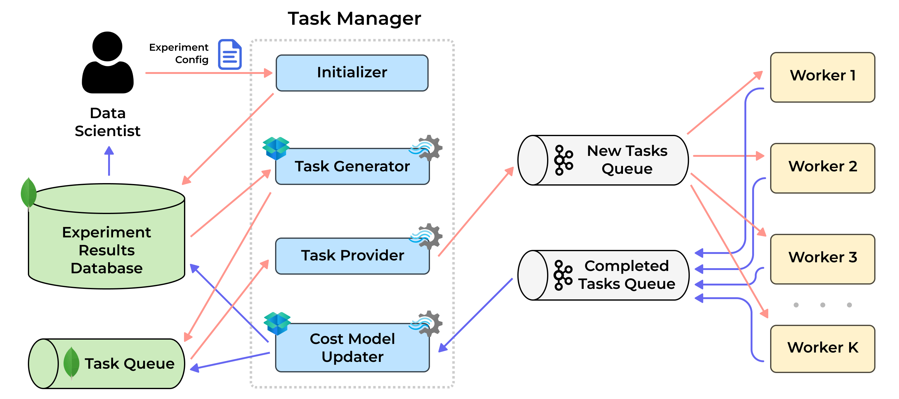

# VirnyFlow: A Design Space for Context-Sensitive Responsible Model Development

<p align="center">
    
</p>

This repository contains the source code for **VirnyFlow**, a flexible and scalable framework for context-sensitive responsible ML pipeline development. VirnyFlow enables multi-stage, multi-objective optimization of ML pipelines with support for fairness, stability, and uncertainty as optimization criteria. The system is designed to facilitate human-in-the-loop workflows through a modular architecture that integrates evaluation protocol definition, Bayesian optimization and distributed execution. The repository also includes experiment configurations, execution scripts, and benchmarking pipelines used in the paper.


## 📒 Repository Structure

**`virny_flow/`**: Core library containing the main functionality
  - `configs/`: Configuration files, constants, and data structures
  - `core/`: Core components of the framework
    - `custom_classes/`: Custom implementations for the framework
    - `error_injectors/`: Components for injecting various types of errors into datasets
    - `fairness_interventions/`: Implementations of fairness intervention techniques
    - `null_imputers/`: Methods for imputing null values in datasets
    - `utils/`: Utility functions used throughout the framework
  - `task_manager/`: Components for distributed task management
    - `database/`: Database interaction layer
    - `domain_logic/`: Business logic for task management
  - `user_interfaces/`: Interfaces for interacting with the system
  - `visualizations/`: Components for visualization of results
  - `external_dependencies/`: External libraries and dependencies

**`virny_flow_interface/`**: Visualization interface of VirnyFlow
- `app.py`: Script to launch a gradio application with all visualizations
- `scripts/configs/`: Configuration files for the demo
- `scripts/run_*.py`: Scripts for running different components of the system
- `docker-compose.yaml`: Docker Compose file for running the demo

**`virny_flow_demo/`**: Demo implementation of VirnyFlow
  - `configs/`: Configuration files for the demo
  - `docker-compose.yaml`: Docker Compose file for running the demo
  - `run_*.py`: Scripts for running different components of the system

**`experiments/`**: Scripts and configurations for experiments
  - `cluster/`: Configuration for distributed computing
  - `scripts/`: Scripts for running experiments
  - `notebooks/`: Jupyter notebooks for analysis and visualization
  - `external/`: External dependencies for experiments

**`tests/`**: Test suite for VirnyFlow
  - `custom_classes/`: Tests for custom class implementations
  - `error_injectors/`: Tests for error injection components
  - `logs/`: Test execution logs

**`docs/`**: Documentation files, including architecture diagrams


## 🛠️ Setup

Create a virtual environment with Python 3.9 and install the following requirements (tested on Apple Silicon M2 and Ubuntu 22.04):
```shell
python -m venv venv 
source venv/bin/activate
pip3 install --upgrade pip3
pip3 install -r requiremnents.txt
```

_[Optional]_ Install datawig:
```shell
pip3 install mxnet-cu110
pip3 install datawig --no-deps

# In case of an import error for libcuda.so, use the command below recommended in
# https://stackoverflow.com/questions/54249577/importerror-libcuda-so-1-cannot-open-shared-object-file
export LD_LIBRARY_PATH=$LD_LIBRARY_PATH:/usr/local/cuda-11.0/compat
```

Add MongoDB secrets (optional). You can deploy a free 500-MB MongoDB cluster on [Atlas](https://www.mongodb.com/docs/atlas/tutorial/deploy-free-tier-cluster/).
```dotenv
# Create virny_flow_demo/configs/secrets.env file with database variables
DB_NAME=your_mongodb_name
CONNECTION_STRING=your_mongodb_connection_string
```


## 🚀 How to Start VirnyFlow

1. Add your datasets to `virny_flow_demo/configs/datasets_config.py`. You need to use a BaseFlowDataset wrapper, where reading and basic preprocessing take place
   ([a link to documentation](https://dataresponsibly.github.io/Virny/examples/Multiple_Models_Interface_Use_Case/#preprocess-the-dataset-and-create-a-baseflowdataset-class)).

2. Create an .env file with environment variables to connect to your MongoDB. The content of the file should be similar to the following:
```shell
DB_NAME=<db_name>
CONNECTION_STRING=mongodb+srv://<db_username>:<db_password>@cluster0.boppxc1.mongodb.net/?retryWrites=true&w=majority&appName=Cluster0
```

3. Create an experiment config, similar to `virny_flow_demo/configs/exp_config.yaml`. A detailed description of each argument is available in the "Experiment Configuration" section below. _Do not forget to set your own `secrets_path`_.

4. Check that paths to your `exp_config.yaml` and `secrets.env` are correct in `virny_flow_demo/run_task_manager.py` and `virny_flow_demo/run_worker.py` modules.

5. Start the system locally and wait for its termination:
```shell
# Start Kafka
/virny-flow/virny_flow_demo $ docker-compose up --build

# Start TaskManager in the root dir
/virny-flow $ python3 -m virny_flow_demo.run_task_manager

# Start Worker in the root dir
/virny-flow $ python3 -m virny_flow_demo.run_worker
```

6. When the execution is complete, shutdown Kafka using the following command:
```shell
/virny-flow/virny_flow_demo $ docker-compose down --volumes
```

7. Look at the metrics of the tuned ML pipelines using VirnyView (more details [in the documentation](https://dataresponsibly.github.io/Virny/introduction/virnyview_overview/)).
```shell
/virny-flow $ python3 -m virny_flow_demo.run_virnyview
```

8. Look at the progress of the Bayesian optimization using OpenBox UI.
```shell
/virny-flow $ python3 -m virny_flow_demo.run_openbox_ui
```


## ⚙️ Experiment Configuration

VirnyFlow uses YAML configuration files to define experiment parameters. These files are typically located in the `virny_flow_demo/configs/` directory. Below is an explanation of the key configuration sections and parameters:

### Configuration Structure

The experiment configuration file is divided into several sections:

```yaml
common_args:
  # General experiment settings
  
pipeline_args:
  # Dataset and model pipeline configuration
  
optimisation_args:
  # Multi-objective optimization settings
  
virny_args:
  # Fairness evaluation settings
```

### Common Arguments

```yaml
common_args:
  exp_config_name: "test_folk_emp"  # Name of the experiment configuration
  run_nums: [1]                     # Run numbers for different random seeds
  secrets_path: "path/to/secrets.env"  # Path to secrets file with database credentials
```

### Pipeline Arguments

```yaml
pipeline_args:
  dataset: "folk_emp"                        # Dataset to use
  sensitive_attrs_for_intervention: ["SEX", "RAC1P"]  # Attributes to use for fairness interventions
  null_imputers: []                          # Null imputation techniques (if any)
  fairness_interventions: []                 # Fairness intervention methods (if any)
  models: ["lr_clf", "rf_clf", "lgbm_clf"]   # ML models to evaluate
```

### Optimization Arguments

```yaml
optimisation_args:
  ref_point: [0.30, 0.10]  # Reference point for hypervolume calculation
  
  objectives:  # Multi-objective optimization targets
    - { name: "objective_1", metric: "F1", group: "overall", weight: 0.25 }
    - { name: "objective_2", metric: "Equalized_Odds_FNR", group: "SEX&RAC1P", weight: 0.75 }

  optimizer:  # Optimizer args for OpenBox
    surrogate_type: 'gp'
    acq_type: 'mesmo'
    acq_optimizer_type: 'local_random'
  
  max_trials: 3               # Maximum number of optimization trials
  num_workers: 2              # Number of parallel workers
  num_pp_candidates: 2        # Number of preprocessing candidates to consider
  
  # Progressive training fractions to evaluate model performance
  training_set_fractions_for_halting: [0.7, 0.8, 0.9, 1.0]
  
  exploration_factor: 0.5     # Controls exploration vs. exploitation trade-off
  risk_factor: 0.5            # Controls risk tolerance in optimization
```

### Evaluation Arguments

```yaml
virny_args:
  # Configuration for sensitive attributes and their values
  sensitive_attributes_dct: {
    'SEX': '2', 
    'RAC1P': ['2', '3', '4', '5', '6', '7', '8', '9'], 
    'SEX&RAC1P': None
  }
```


## ⚖️ Comparison with Existing ML Systems

The below table summarizes a list of existing ML systems we compare VirnyFlow with, their source repos, papers, and links to our adaptation in code. 

<div style="overflow-x:auto;">

| Name          | Source Paper                                                                                                                                                                                                                                                                            | Source Repo                                                                                         | Adapted Implementation                     |
|---------------|-----------------------------------------------------------------------------------------------------------------------------------------------------------------------------------------------------------------------------------------------------------------------------------------|-----------------------------------------------------------------------------------------------------|--------------------------------------------|
| Alpine Meadow | [Zeyuan Shang, Emanuel Zgraggen, Benedetto Buratti, Ferdinand Kossmann, Philipp Eichmann, Yeounoh Chung, Carsten Binnig, Eli Upfal, and Tim Kraska. 2019. Democratizing data science through interactive curation of ml pipelines.](https://dl.acm.org/doi/abs/10.1145/3299869.3319863) | Shared by the authors privately                                                                     | Hidden according to authors' request       |
| auto-sklearn  | [Matthias Feurer, Katharina Eggensperger, Stefan Falkner, Marius Lindauer, and Frank Hutter. 2022. Auto-sklearn 2.0: Hands-free automl via meta-learning.](https://dl.acm.org/doi/abs/10.5555/3586589.3586850)                                                                          | [GitHub](https://github.com/automl/auto-sklearn) | [Code](experiments/external/auto-sklearn/) |
| FLAML         | [Chi Wang, Qingyun Wu, Markus Weimer, and Erkang Zhu. 2021. Flaml: A fast and lightweight automl library.](https://proceedings.mlsys.org/paper_files/paper/2021/hash/1ccc3bfa05cb37b917068778f3c4523a-Abstract.html)                                                                                                                          | [GitHub](https://github.com/microsoft/FLAML) | [Code](experiments/external/flaml/)        |

</div>


## 🔬 Experimental Results Reproducibility

Table summarizing details for reproducibility of experimental results.

<div style="overflow-x:auto;">

| Name                                                                                      | Description                                                                                                                 | Execution Scripts                                       | Visualizations                                                    |
|-------------------------------------------------------------------------------------------|-----------------------------------------------------------------------------------------------------------------------------|---------------------------------------------------------|-------------------------------------------------------------------|
| **Experiment 1:** Functionality of the System [_Section 3.2 in the paper_].               | Is our system able to optimize ML pipelines according to different multi-objective optimization criteria?                   | [Bash scripts](./experiments/cluster/case_studies_exp/) | [Plots](./experiments/notebooks/visualizations/case_studies_exp/) |
| **Experiment 2:** Performance Comparison with Other Systems [_Section 3.3 in the paper_]. | How does our system compare to state-of-the-art AutoML systems in terms of performance?                                     | [Bash scripts](./experiments/cluster/comparison_exp2/) | [Plots](./experiments/notebooks/visualizations/comparison_exp/) |
| **Experiment 3:** Scalability [_Section 3.3 in the paper_].                               | How does our system compare to state-of-the-art AutoML systems in terms of scalability?                                     | [Bash scripts](./experiments/cluster/scalability_exp/) | [Plots](./experiments/notebooks/visualizations/scalability_exp/) |
| **Experiment 4.1:** System Configuration Sensitivity [_Section 3.4 in the paper_].        | What is the sensitivity of our system to varying the number of physical pipeline candidates per logical pipeline selection? | [Bash scripts](./experiments/cluster/sensitivity_exp/) | [Plots](./experiments/notebooks/visualizations/sensitivity_exp/) |
| **Experiment 4.2:** System Configuration Sensitivity [_Section 3.4 in the paper_].        | What is the sensitivity of our system to varying the training set fractions for pruning?                                    | [Bash scripts](./experiments/cluster/sensitivity_exp2/) | [Plots](./experiments/notebooks/visualizations/sensitivity_exp/) |

</div>
